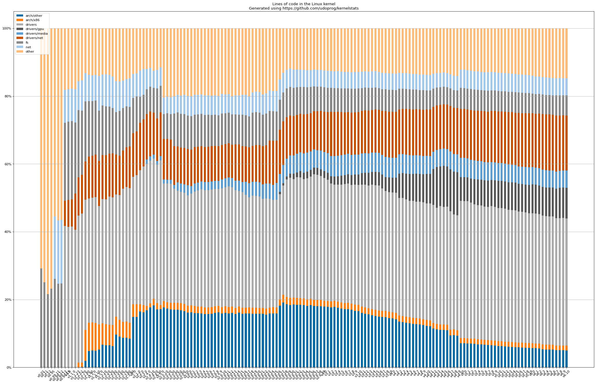
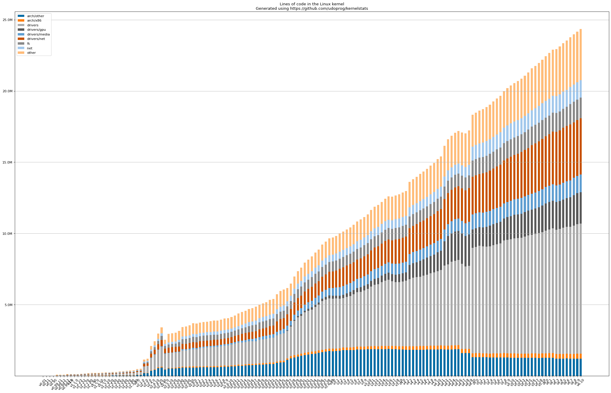

# kernelstats

This project contains a Rust application that extracts statistics about Linux releases from
a git repository, and a Jupyter notebook for setting up interesting visualizations.

## Dependencies

 * git
 * [tokei](https://github.com/Aaronepower/tokei)
 * [Jupyter](http://jupyter.org/) with [matplotlib](https://matplotlib.org/)
 * [A couple of patches to tar-rs](https://github.com/alexcrichton/tar-rs/pulls/udoprog).

## Features

 * Iterates over git tags and generate statistics per-tag (`--kernel-git`).
 * Downloads tarballs for [older releases](https://mirrors.kernel.org/pub/linux/kernel) based on
   [`src/kernels.yaml`](src/kernels.yaml).

## Extracting and Plotting

**Warning:** Running kernelstats against an existing git directory is currently destructure to any
changes in that directory.

Run kernelstats:

```
RUST_LOG=info cargo run +nightly -- --kernel-git path/to/linux.git
```

Start Jupyter Notebook:

```
jupyter notebook
```

## Images Generated

#### Percentage distributions



#### Millions of lines of code over time


